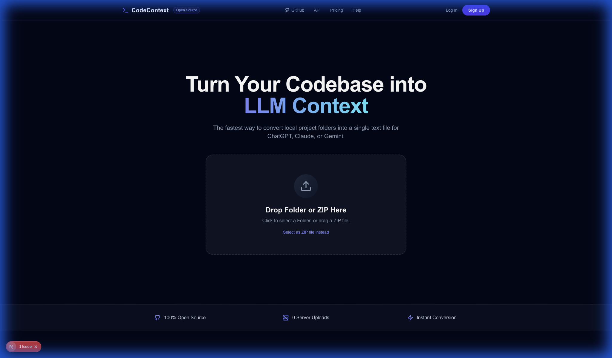
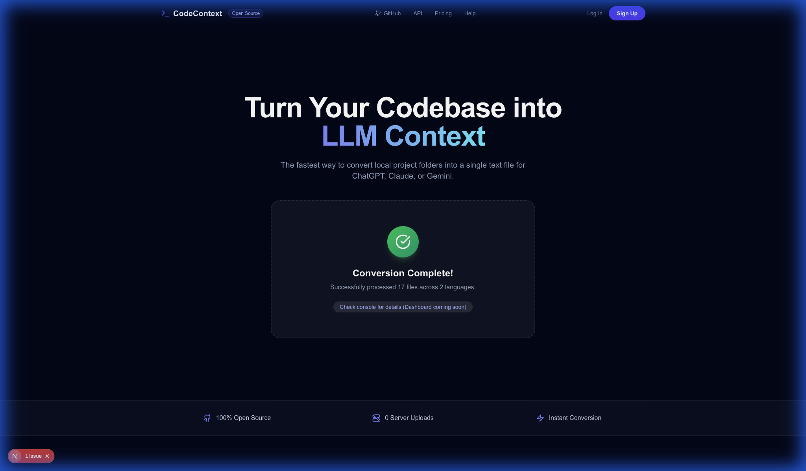
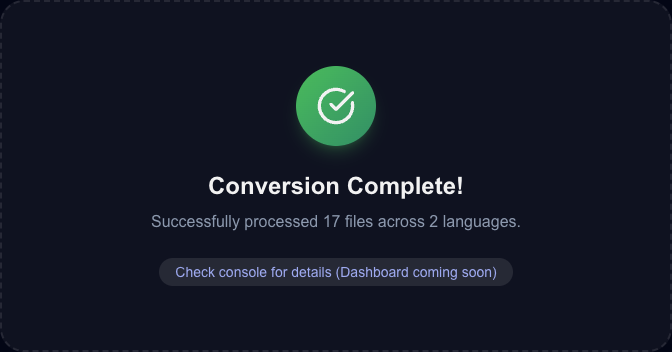
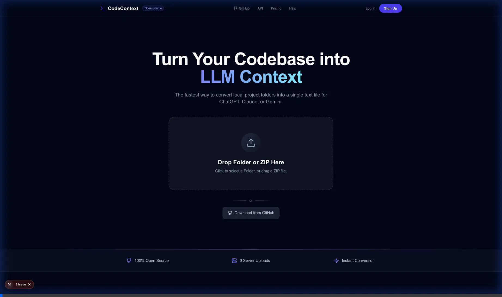

# CodeContext

**Convert your entire codebase into a single text file for LLMs.**

[**Live Demo: context.enesdemir.me**](https://context.enesdemir.me)

CodeContext is a powerful, secure, and lightning-fast tool designed to help developers easily share their code context with Large Language Models (LLMs) like GPT-4, Claude, and Gemini.

## 🚀 Features

- **Client-Side Processing:** Files are processed in the browser, zero server uploads.
- **Smart Filtering:** Automatically ignores `node_modules`, `.git`, `.env`, and binary files.
- **Language Detection:** Groups files by extension (e.g., Python, TypeScript).
- **Dark Mode UI:** Designed with a clean, developer-focused interface.
- **Instant Preview:** View the generated text before downloading or copying.
- **Optimized for LLMs:** Formats the output with clear delimiters, making it easy for AI to understand your project structure.

### 🆕 GitHub Integration (v1.1.0)

- **Download from GitHub:** Import public repositories directly via URL
- **Visual File Tree:** Browse repository structure in an interactive tree view
- **Smart Selection:** Select parent folders to include all children, or pick individual files
- **Bulk Actions:** Select All / Deselect All, Expand All / Collapse All
- **Progress Tracking:** Real-time download progress indicator

## 🛠️ How It Works

### Option 1: Upload Your Project

#### 1. Upload Your Project
Select your project folder or drag and drop it into the upload area.


#### 2. Configure & Filter
Select specific files or folders you want to include. The tool automatically handles ignores for you.



#### 3. Processing
Watch as your files are securely processed right in your browser.



#### 4. Generate & Export
Get a single consolidated text file ready for your favorite AI assistant.



---

### Option 2: GitHub Integration



#### 1. Click "Download from GitHub"
Find the button below the upload area.

#### 2. Enter Repository URL
Paste a public GitHub repository URL (e.g., `https://github.com/user/repo`).

#### 3. Browse & Select Files
Explore the repository's file structure in a tree view. Click folders to expand, use checkboxes to select files.

- ✅ Select a folder to include all its contents
- ✅ Use "Select All" / "Deselect All" for bulk operations
- ✅ Expand/Collapse folders for easier navigation

#### 4. Download
Click the download button to get your `.txt` file with all selected code.

## 💻 Getting Started

### Prerequisites

- Node.js 18+ installed on your machine.
- npm, yarn, or pnpm.

### Installation

1. Clone the repository:
   ```bash
   git clone https://github.com/EnesDemir143/code-to-text.git
   cd code-to-text
   ```

2. Install dependencies:
   ```bash
   npm install
   # or
   yarn install
   # or
   pnpm install
   ```

3. Run the development server:
   ```bash
   npm run dev
   # or
   yarn dev
   # or
   pnpm dev
   ```

4. Open [http://localhost:3000](http://localhost:3000) with your browser to use the application.

## 📋 API Limits

> **Note:** GitHub integration uses the public GitHub API which has a rate limit of 60 requests per hour for unauthenticated users. For larger repositories or frequent use, consider using the local folder upload option.

## 🤝 Contributing

Contributions are welcome! Whether it's a bug fix, new feature, or documentation improvement, I'd love to hear from you.

1. Fork the project.
2. Create your feature branch (`git checkout -b feature/AmazingFeature`).
3. Commit your changes (`git commit -m 'Add some AmazingFeature'`).
4. Push to the branch (`git push origin feature/AmazingFeature`).
5. Open a Pull Request.

### Contact

For any inquiries, feedback, or collaboration opportunities, please reach out:

📧 **Email**: [enesdemirdev@gmail.com](mailto:enesdemirdev@gmail.com)

---

Built with ❤️ using [Next.js](https://nextjs.org), [React](https://react.dev), and [Tailwind CSS](https://tailwindcss.com).

